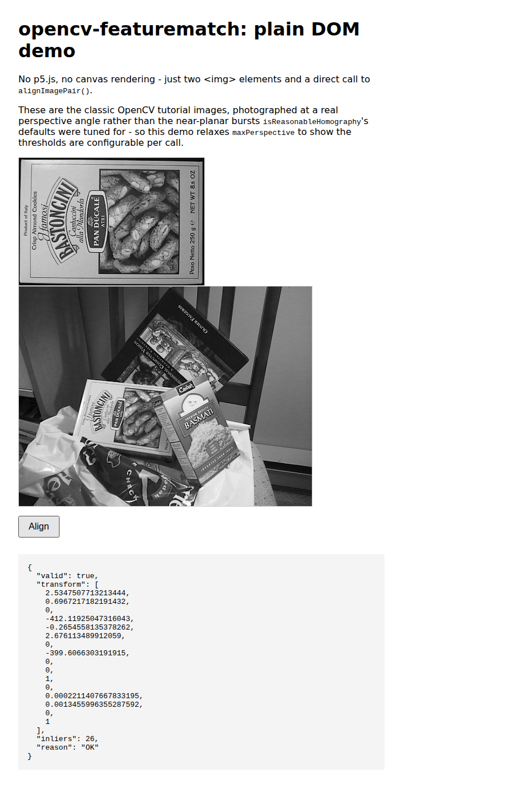
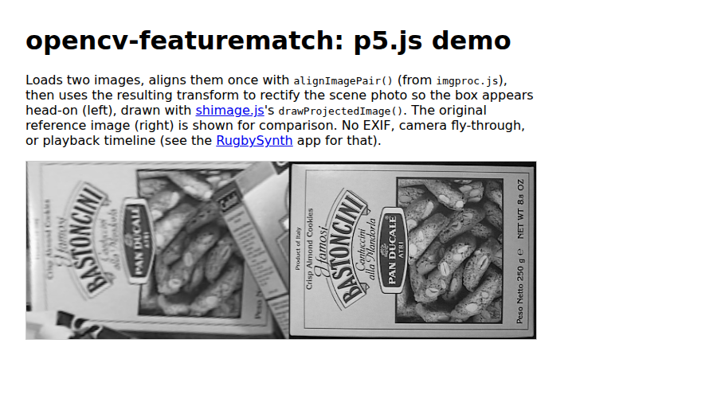

# opencv-featurematch-js

A small JavaScript library for feature-based image alignment in the browser, built on [OpenCV.js](https://docs.opencv.org/4.x/d5/d10/tutorial_js_root.html). Given two images, it finds matching features (ORB/KAZE + RANSAC), computes a homography between them, and hands back a transform you can use to warp one image onto the other.

Originally adapted from Scott Suhy's [Image Alignment (Feature Based) in OpenCV.js](https://web.archive.org/web/20210201184709/https://scottsuhy.com/2021/02/01/image-alignment-feature-based-in-opencv-js-javascript/) tutorial (original link now dead; attribution kept in `opencv-featurematch-js.js`).

## The library

Everything ships as a single file, **`opencv-featurematch-js.js`**:

- The core feature-matching/homography computation (`Align_img`), adapted from the tutorial above.
- Alignment math on top: 3x3/4x4 matrix helpers (including `invertMatrix3x3`/`invertMatrix4x4`), homography validation (`isReasonableHomography`) and shear cleanup (`stripShear`), and the clean two-image primitive most consumers actually want:

```js
const result = alignImagePair(imageA, imageB, options);
// -> { valid: true, transform: [16 numbers, row-major 4x4], transform2D: [9 numbers, row-major 3x3], inliers: 26, reason: 'OK' }
```

`alignImagePair` exists because `Align_img` itself doesn't return anything - it's an OpenCV.js port that mutates module-level globals (`h`, `good_inlier_matches`). `alignImagePair` wraps that and gives you a real return value instead. It's synchronous throughout: every OpenCV.js call inside `Align_img` (`detectAndCompute`, `knnMatch`, `findHomography`) is a synchronous WASM operation, nothing here is ever awaited.

`transform` and `transform2D` are the same homography in two shapes: `transform` is padded to a flat 16-element row-major 4x4 (for `drawProjectedImage`'s 3D/WEBGL quad warp and the other 4x4 matrix helpers below), `transform2D` is the raw flat 9-element row-major 3x3 (for anyone doing their own 2D projective math directly).

Before calling either of the above, `await cvLoaded()` - opencv.js's `<script onload>` fires once its JS wrapper has loaded, not once its WASM runtime has actually finished initializing, and calling into this library before that finishes throws `"undefined is not a constructor"`:

```js
await cvLoaded();
const result = alignImagePair(imageA, imageB, options);
```

`result.transform` is a flat 16-element row-major 4x4 matrix - the right shape for `drawProjectedImage()`'s 3D/WEBGL quad warp, but not for plain 2D canvas/p5.js drawing. `to2dAffine` converts it to the 6-element `[a, b, c, d, e, f]` array that both the canvas API's `setTransform()` and p5.js's `applyMatrix()` (2D mode) expect:

```js
applyMatrix(to2dAffine(result.transform));
```

The library is deliberately just feature matching and math - no DOM conventions (how a transform gets stored on an element, how images get downscaled/masked), no rendering, no EXIF/camera/playback, and no multi-image sequencing policy (which candidate to try, when to stop). All of that is application-specific. [davidchatting/shimage](https://github.com/davidchatting/shimage) covers the p5.js/WEBGL rendering side (converting a DOM image to a texture, drawing a warped quad); see [RugbySynth](https://github.com/davidchatting-bot/RugbySynth) for a full application built on both (EXIF-timed playback, a 3D camera fly-through, foreground/background segmentation).

A minified build, `opencv-featurematch-js.min.js`, is generated automatically by CI on every push to `main` (see `.github/workflows/build-min.yml`) and committed back alongside the source - both are available via jsDelivr:

```
https://cdn.jsdelivr.net/gh/davidchatting/opencv-featurematch-js@main/opencv-featurematch-js.min.js
```

## Demos

### Plain DOM demo

No p5.js, no canvas rendering - two `` elements and a direct call to `alignImagePair()`.

[**Live demo**](https://davidchatting.github.io/opencv-featurematch-js/demos/dom/) · [source](demos/dom/index.html)



### p5.js demo

Aligns two images, then uses the resulting transform to rectify a photo so the object in it appears head-on, via [shimage.js](https://github.com/davidchatting/shimage)'s `drawProjectedImage()`.

[**Live demo**](https://davidchatting.github.io/opencv-featurematch-js/demos/p5js/) · [source](demos/p5js/index.html)



### p5.js editor sketch

A minimal, editable sketch showing `openCvLoaded()` + `alignImagePair()` in the smallest amount of code, loaded straight from the CDN.

[**Open in the p5.js editor**](https://editor.p5js.org/davidchatting/sketches/YHF4dsSbR)

## License

MIT - see [LICENSE](LICENSE).
